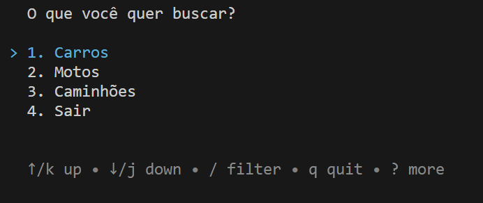
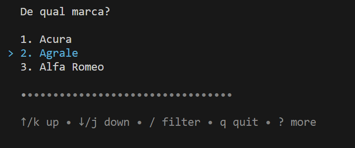
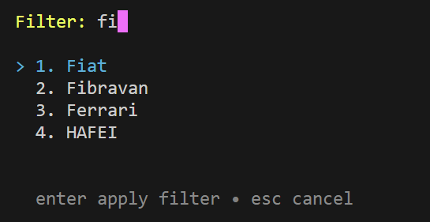
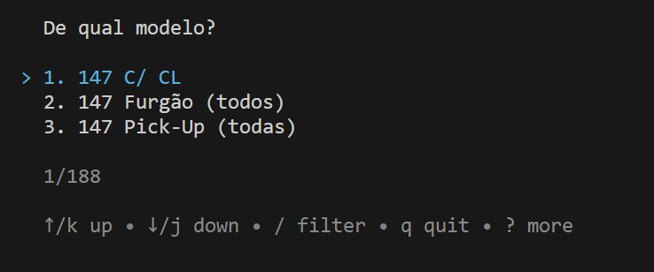
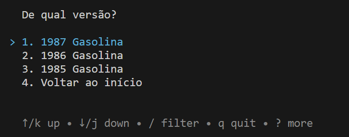
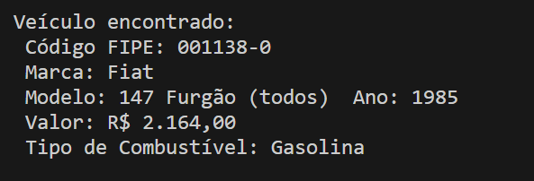

# gofipe

I developed this just to practice [charmbracelet/bubbletea](https://github.com/charmbracelet/bubbletea). I looked for a [public API related to Vehicles](https://github.com/public-apis/public-apis?tab=readme-ov-file#vehicle) to do something and found [Brazilian Vehicles and Prices](https://deividfortuna.github.io/fipe/), a platform made to check the vehicle prices at our national FIPE table. You can use this CLI platform to run that API.

# How to run

1. You must have [Golang v1.20+](https://go.dev/) installed on your machine. If you don't have, access its page, download and install it;
2. Clone this repository;
3. Open a terminal on the root path of the cloned repository;
4. Run `go run .` and follow the software instructions!

You can also build an executable by running `go build .`

# Execution samples

## Passo 1: seleção de tipo de veículo

## Passo 2.1: seleção de marca

## Passo 2.2: seleção de marca com filtro (após digitar `/`)

## Passo 3: seleção de modelo

## Passo 4: seleção de versão

## Passo 5: página de resultado da busca com os dados selecionados anteriormente
